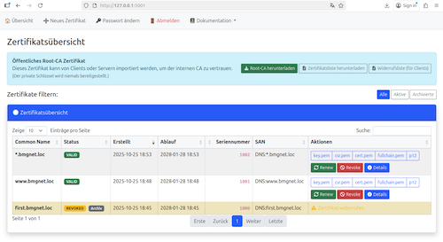

# 🧩 My Root CA — Interne Root-CA mit OpenSSL, Bash & Python Web-GUI

Dieses Projekt stellt eine interne Root-Zertifizierungsstelle (CA) bereit — aufgebaut auf
OpenSSL, Bash-Automatisierung und einer Python/Flask-basierten Verwaltungsoberfläche.
Ideal für Homelabs, interne Server, Testumgebungen oder private Infrastrukturen.



## 🎯 Ziele

- Aufbau einer internen Root-CA mit OpenSSL
- Verwaltung von privaten & öffentlichen Schlüsseln
- Ausstellung, Widerruf und Archivierung von Server-Zertifikaten
- Unterstützung von DNS-Namen (z. B. web01.lab.local) und IP-Adressen
- Komfortable Verwaltung über ein Web-Interface

---

## 📁 Projektstruktur

```
my-root-ca/
├── app.py                     # Flask-App (Web GUI)
├── ca/                        # Root-CA-Struktur
│   ├── apache-crl/            # exportierte CRL für Apache / Webserver
│   ├── certs/                 # Root-CA-Zertifikate
│   ├── crl/                   # aktuelle Sperrlisten (PEM & DER)
│   ├── newcerts/              # intern durch OpenSSL verwendet
│   ├── private/               # privater CA-Schlüssel + Passwortdatei
│   ├── index.txt, serial      # CA-Datenbank + Zähler
│   ├── openssl.cnf            # automatisch generierte CA-Konfiguration
│   └── cleanup.log            # Archivierungs-Log
│
├── ca_tools/                  # Python-Hilfsprogramme (z. B. zum Auflisten)
│   └── list_certs.py
│
├── ca_tools_bash/             # Bash-Automatisierungsskripte
│   ├── init_root_ca.sh        # Erstellt die Root-CA-Struktur
│   ├── issue_server_cert.sh   # Stellt neue Server-Zertifikate aus
│   ├── revoke_cert.sh         # Widerruft Zertifikate + aktualisiert CRL
│   ├── archive_cert.sh        # Verschiebt abgelaufene/widerrufene Zertifikate ins Archiv
│   ├── export_crl.sh          # Exportiert CRL nach Apache-Verzeichnis
│   └── list_certs.sh          # Listet CA-Zertifikate über OpenSSL
│
├── config/
│   └── passwd.db              # Admin-Login-Datenbank (bcrypt-Hash)
│
├── config.env                 # Hauptkonfigurationsdatei (benutzerdefiniert)
├── config.env.example         # Beispielkonfiguration
├── config.py                  # Flask-Konfigurationsklasse
│
├── doku/                      # Markdown-Dokumentation (für Webmenü)
│   ├── archive_cert.md
│   ├── config_env_guide.md
│   ├── config_py_parameters.md
│   ├── init_root_ca.md
│   ├── installation_guid.md
│   └── issue_server_cert.md
│
├── issued/                    # ausgestellte Zertifikate
│   ├── archive/               # widerrufene / abgelaufene Zertifikate
│   ├── *.cert.pem             # Zertifikat
│   ├── *.csr.pem              # Certificate Signing Request
│   ├── *.fullchain.pem        # Chain (Server + CA)
│   ├── *.key.pem              # privater Schlüssel
│   └── *.p12                  # PFX/P12 für Windows
│
├── static/                    # AdminLTE + Bootstrap-Assets
│   └── adminlte/
│
├── templates/                 # HTML-Templates (Jinja2)
│   ├── layout.html            # Hauptlayout
│   ├── cert_list.html         # Zertifikatsübersicht
│   ├── cert_create.html       # Zertifikatserstellung
│   ├── change_password.html   # Passwort ändern
│   ├── login.html             # Login-Seite
│   └── docs.html              # Markdown-Dokumentationsansicht
│
├── requirements.txt           # Python-Abhängigkeiten
└── readme.md                  # (diese Datei)
```

---

## 🧩 Hauptkomponenten

### 🔹 OpenSSL & Bash-Skripte CLI

Die CA-Grundfunktionen der CLI laufen über OpenSSL-Kommandos, verpackt in Bash-Skripte:

| Skript | Beschreibung |
|--------|---------------|
| `init_root_ca.sh` | Erstellt die komplette Root-CA-Struktur mit OpenSSL-Konfiguration |
| `issue_server_cert.sh` | Stellt Server-Zertifikate aus (mit DNS/IP SANs) |
| `revoke_cert.sh` | Widerruft Zertifikate und aktualisiert die CRL |
| `archive_cert.sh` | Verschiebt abgelaufene/widerrufene Zertifikate ins Archiv |
| `export_crl.sh` | Exportiert die aktuelle CRL (z. B. für Apache) |

## 🔹 Python Flask Web-Interface

Ergänzend zu den CLI-Tools bietet die Web-App:
- Übersicht über alle Zertifikate (issued/, archive/)
- Neue Zertifikate per Formular anlegen
- Zertifikatsdetails & Downloads (cert.pem, key.pem, csr.pem, p12)
- Revoke / Renew / Detail-Ansicht
- Passwort ändern (Admin)
- Markdown-Dokumentation im Menü Dokumentation (automatisch aus doku/ geladen)

---

## 🧠 Verwendung

### 1️⃣ Installation
```bash
git clone <repo-url> my-root-ca
cd my-root-ca
cp config.env.example config.env
python3 -m venv venv
source venv/bin/activate
pip install -r requirements.txt
```

### 2️⃣ Konfiguration anpassen

Passe in config.env folgende Punkte an:
- Basisverzeichnisse
- CA Identität
- CA Zertifikat Erweiterung
- CA Sicherheit
- CERT Sicherheit

→ siehe [config_env_guide.md](doku/config_env_guide.md)

### 3️⃣ My Root CA initialisieren

🛠️ Skript: My Root CA erzeugen (`init_root_ca.sh`)

```bash
./ca_tools_bash/init_root_ca.sh
```

> Während der Initialisierung wird automatisch eine Passwortabfrage angezeigt:

```
🔐 Bitte ein neues Passwort für die Root-CA festlegen 
(wird in ~/my-root-ca/ca/private/ca.pass gespeichert):
```

### 4️⃣ Web-App starten

```bash
source venv/bin/activate
python app.py
```

Öffne anschließend: [http://127.0.0.1:5001](http://127.0.0.1:5001)

Login:  
**Benutzer:** `admin`  
**Passwort:** `admin` 


---

## Information zu den Zertifikaten

**Default Passwort der Zertifikate Ist das Datum des erstellens**
```
YYYMMDD
```

---

## 💡 Beispiel

## 🛠️ Skript: Server-Zertifikate ausstellen (`issue_server_cert.sh`)

Zertifikat für Server mit einem CN (Common Name) und einem SAN (Subject Alternative Name) und IP Adresse :**
```bash
./issue_server_cert.sh -c wwww.test-lab.loc -d demo.test-lab.loc -i 10.0.0.5
```

---

## 💡  My Root CA vertrauen

## Linux (Debian/Ubuntu):

```bash
sudo cp ~/my-root-ca/ca/certs/ca.cert.pem /usr/local/share/ca-certificates/internal-ca.crt
sudo update-ca-certificates
```

## Windows:

```
Zertifikat `ca.cert.pem` in **"Vertrauenswürdige Stammzertifizierungsstellen"** importieren.
```

---

## 📦 Third-Party Components


### 🧩 jQuery 3.7.1
- **Website:** [https://jquery.com/](https://jquery.com/)  
- **Lizenztext:** [https://jquery.org/license/](https://jquery.org/license/)

---

### 🧩 Bootstrap 5.1.3
- **Website:** [https://getbootstrap.com/](https://getbootstrap.com/)  
- **Lizenztext:** [https://github.com/twbs/bootstrap/blob/main/LICENSE](https://github.com/twbs/bootstrap/blob/main/LICENSE)

---

### 🧩 DataTables
- **Website:** [https://datatables.net/](https://datatables.net/)  
- **Lizenztext:** [https://datatables.net/license/mit](https://datatables.net/license/mit)

---

### 🧩 Moment.js
- **Website:** [https://momentjs.com/](https://momentjs.com/)  
- **Lizenztext:** [https://github.com/moment/moment/blob/develop/LICENSE](https://github.com/moment/moment/blob/develop/LICENSE)

---

### 🧩 AdminLTE 4.0.0-rc4
- **Website:** [https://github.com/ColorlibHQ/AdminLTE](https://github.com/ColorlibHQ/AdminLTE)  
- **Lizenztext:** [https://github.com/ColorlibHQ/AdminLTE/blob/master/LICENSE](https://github.com/ColorlibHQ/AdminLTE/blob/master/LICENSE)

---

### 🧩 Font Awesome Free 7.1.0
- **Website:** [https://fontawesome.com/](https://fontawesome.com/)  
- **Lizenztext:** [https://fontawesome.com/license/free](https://fontawesome.com/license/free)
